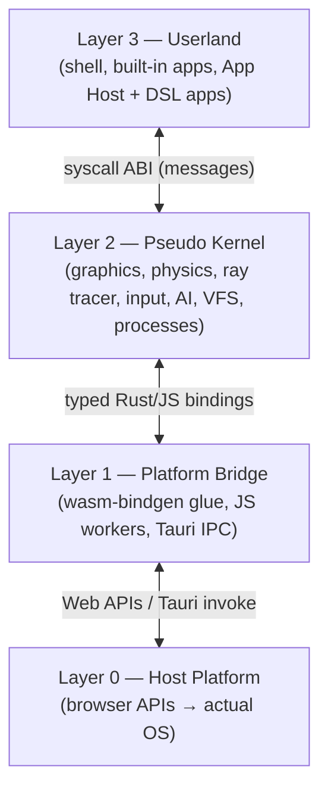

# Architecture
**Pseudo Motion OS — Specification v0.3** · part of [[Pseudo Motion OS]]

This document specifies the layered architecture in detail: what each layer and subsystem does, why it exists, how the pieces interface with each other, and how the whole system interfaces with the browser and the actual operating system.

---

## 1. Layer Model

PMOS has four layers. Only adjacent layers may talk to each other.



**Why layered this way:** the syscall ABI (2↔3 boundary) is the *product* boundary — it defines what an app is and must stay stable and versioned. The platform bridge (1↔2 boundary) is an *implementation* boundary — it isolates every `web-sys`/JS call so the kernel core is pure Rust, testable natively, and portable to future hosts (e.g. a WASI runtime) without touching userland.

---

## 2. Layer 0 — Host Platform

The browser **is** the hardware abstraction layer. Each classical OS resource maps to a web API:

| Classical resource | PMOS uses | Notes |
|---|---|---|
| GPU / display | **WebGPU** via one `<canvas>` | Single fullscreen canvas; the kernel owns it exclusively. |
| Disk | **OPFS** (Origin Private File System) | Real byte streams, sync access handles inside a worker. IndexedDB fallback where OPFS is unavailable. |
| Camera | **getUserMedia** | Consumed only inside the gesture worker. |
| Microphone | **Web Speech API** / getUserMedia | See [[AI System#Voice pipeline]]. |
| CPU cores | **Web Workers** | Plain workers (no SharedArrayBuffer in v1 — see §8). |
| Network | **fetch** | LLM APIs and optional web content; subject to CORS. |
| Clock | `performance.now()` | Monotonic time source for the frame loop and physics. |
| Persistence of settings | OPFS (files) | Everything is a file in the VFS; no scattered localStorage. |

In **Tauri desktop mode**, Layer 0 additionally exposes: native filesystem (mounted into the VFS, §5.6), child webviews (real browsing), and future native plugins (depth cameras etc.) via `tauri::command` IPC.

---

## 3. Layer 1 — Platform Bridge

All JavaScript interop lives in one crate, `pmos-platform`. Nothing outside it may import `web-sys`/`js-sys`. It provides Rust traits the kernel consumes:

- `GpuSurface` — canvas acquisition, resize events, `requestAnimationFrame` scheduling (via winit).
- `StorageBackend` — async byte-level file ops, implemented by an **OPFS worker** (sync access handles are worker-only, which is why this worker exists) with an IndexedDB implementation as fallback.
- `CameraTracker` — spawns the **gesture worker** (JS): getUserMedia → MediaPipe `HandLandmarker` (GPU delegate) → landmark frames posted to WASM as compact `Float32Array`s. The worker owns the camera; the kernel only ever sees landmarks — a privacy boundary as much as an architectural one.
- `SpeechIn` — Web Speech API wrapper (interim + final transcripts) with a feature flag for a future Whisper worker.
- `HttpClient` — fetch wrapper with streaming (SSE) support for LLM responses.
- `NativeHost` (Tauri only) — `invoke()` bridge for native FS mounts and child-webview control; a no-op stub in pure browser mode.

**Worker topology (v1):** main thread (WASM kernel + userland + render) · gesture worker (JS + MediaPipe) · storage worker (JS + OPFS). AI streaming is async on the main thread (fetch does not block). WASM threads/`rayon` are deliberately deferred (§8).

---

## 4. Layer 2 — Pseudo Kernel

One Rust crate, `pmos-kernel`, composed of subsystems that communicate through direct calls internally, but are *only* reachable from userland via the syscall ABI (§6).

### 4.1 Graphics Engine (`gfx`)
Owns the wgpu `Device`/`Queue` and a small **render graph** executed once per frame:

1. **Window-content passes** — each userland window's egui output is rendered into its own texture (windows are textures, which is what lets them exist both in the 2D overlay and pinned inside the 3D scene).
2. **3D scene pass** — forward renderer (PBR-lite) for the stage: floor, props, physics objects, window quads.
3. **Ray-trace compute pass** *(budgeted, async)* — dispatches at most N ms of compute per frame into a persistent accumulation texture; progressive refinement across frames; the result is just another texture any window can display.
4. **Overlay pass** — egui top-level UI (dock, palette, cursors, notifications) composited last.

Resources are handle-based (`TextureHandle`, `MeshHandle`): userland never sees wgpu types, only opaque IDs — this is what keeps the ABI serializable and future-proof for out-of-process apps.

### 4.2 Physics (`phys`)
`rapier3d` world stepped on a **fixed timestep** (default 120 Hz, accumulator pattern) decoupled from render rate, with interpolation for display. Exposes: spawn/despawn rigid bodies & colliders, impulses/forces, kinematic targets (for grabbed objects), raycasts (used by picking), and collision events. CPU-only by design (see [[Pseudo Motion OS#5. Technology Stack & Justification]]).

### 4.3 Ray Tracer (`rt`)
Whitted-style recursive tracer in WGSL compute: spheres, planes, reflect/refract, shadows, area lights, configurable bounce depth. Scene described by a compact GPU buffer (uploaded on change); accumulation buffer resets on camera/scene edits. Interface: `rt.set_scene(desc)`, `rt.get_texture() -> TextureHandle`, `rt.set_quality(q)`.

### 4.4 Input Pipeline (`input`)
Fuses four sources into one event stream with a **source tag**: mouse/keyboard (winit), gesture events (from the gesture worker via the recognizer — see [[Hand Gestures#Recognition pipeline]]), voice transcripts, and synthetic events (AI-initiated actions). Produces high-level events (`PointerMove`, `Select`, `GrabStart/End`, `SwipeLeft`, `PaletteToggle`, …) delivered to the focused process by the process manager. **Why fusion:** userland apps must not care whether a click came from a mouse or a pinch — this is what makes the one-hand/no-hand policy cheap to uphold.

### 4.5 AI Agent Manager (`ai`)
Manages LLM agents as kernel objects with provider bindings, streaming, and a tool interface onto syscalls. Fully specified in [[AI System]].

### 4.6 Virtual File System (`vfs`)
POSIX-like tree (`/home`, `/apps`, `/notes`, `/sys`, `/mnt`) over `StorageBackend`. Features: byte-stream files, directories, metadata (mtime, size, MIME), watch events (used by [[Notes System]] backlink indexing and the File Explorer). `/sys` is a synthetic tree exposing kernel state as readable files (`/sys/fps`, `/sys/processes`, `/sys/memory`) — this is what the terminal's "how much RAM is free?" reads. In Tauri mode, native folders mount under `/mnt`.

### 4.7 Process & Capability Manager (`proc`)
- A **process** is a kernel bookkeeping object: PID, name, capability set, window handles, event queue, and an `update` entry point.
- **Scheduling is cooperative on the main thread**: each frame, every runnable process gets an `update(ctx)` slice (egui is immediate-mode, so UI *is* the update). DSL apps additionally get per-event **step budgets** enforced by the App Host interpreter (see [[App DSL#Limits]]), which is how a runaway generated app is contained without preemption.
- **Capabilities** are the security model: a bitset+scoped-paths structure (`win:own`, `fs:read:/notes/**`, `net:llm`, `ai:prompt`, `phys:spawn`, `input:raw-hands`, …). Every syscall is checked. Built-in apps get generous grants at compile time; DSL apps get a minimal default and must trigger a **user consent prompt** for more. See [[App DSL#Capabilities]] and [[AI System#Safety]].

---

## 5. Layer 3 — Userland

- **Shell** (window manager, dock, launcher, palette, notifications) — specified in [[UI]].
- **Built-in apps** — Terminal, File Explorer, [[Notes System]], Settings, Browser App. Compiled into the binary as Rust modules, but structured as processes that use the syscall ABI exclusively (enforced by crate visibility: built-ins live in `pmos-apps`, which depends only on `pmos-abi`, never on `pmos-kernel` internals). **Why:** they are permanent integration tests of the ABI; if the terminal can be built on the ABI, third-party apps can be too.
- **App Host** — the interpreter process that loads, validates, and runs Conjure documents ([[App DSL]]). One host instance per running DSL app, so each gets its own process identity, capability set, and step budgets.

---

## 6. Kernel ABI

The contract between layers 2 and 3. Shape:

```rust
// crate pmos-abi — the ONLY thing userland links against
pub const ABI_VERSION: (u16, u16) = (1, 0);   // (major, minor)

pub enum Syscall {
    // window
    WinCreate { title: String, size: [f32; 2], flags: WinFlags },
    WinClose { win: WinId },
    WinPinTo3D { win: WinId, transform: Transform },
    // vfs
    FsRead { path: PathBuf },            FsWrite { path: PathBuf, bytes: Vec<u8> },
    FsList { path: PathBuf },            FsWatch { path: PathBuf },
    // physics
    PhysSpawn { desc: BodyDesc },        PhysImpulse { body: BodyId, v: Vec3 },
    // ray tracer
    RtSetScene { scene: SceneDesc },     RtGetTexture,
    // ai
    AiPrompt { agent: AgentId, msg: String, tools: bool },
    AiSpawnAgent { config: AgentConfig },
    // input
    InputSubscribe { mask: EventMask },
    // process
    ProcSpawnApp { conjure_doc: String }, ProcKill { pid: Pid },
    CapRequest { caps: Vec<Capability>, reason: String },
    // ...
}

pub enum KernelEvent { /* input events, fs watch, ai stream chunks, collision, … */ }
```

Rules:
- **Message-passing semantics.** In v1 (same memory) calls are dispatched directly for speed, but every payload type must be `serde`-serializable — the *discipline* that later allows real process isolation (separate WASM instances in workers, postMessage transport) with zero userland changes.
- **Versioned.** Processes handshake with `ABI_VERSION`; additive changes bump minor, breaking changes bump major. The kernel may support N and N-1 majors.
- **Capability-checked.** Every syscall carries the caller's PID; `proc` validates before dispatch. Denials return typed errors, never panics.
- **Async by default.** Results arrive as `KernelEvent`s on the process queue; nothing in userland can block the frame.

---

## 7. The Frame Loop

One `requestAnimationFrame`-driven tick (via winit on web):

```
1. Pump platform events      (winit input, worker messages: landmarks, fs, ai chunks)
2. Input fusion              (raw → high-level events, gesture recognition update)
3. Syscall dispatch          (drain per-process syscall queues, capability checks)
4. Physics                   (fixed-timestep accumulator; 0..k steps of 1/120 s)
5. Userland update           (each process's update(); egui builds window UIs)
6. Render graph              (window textures → 3D pass → budgeted RT compute → overlay)
7. Present + housekeeping    (event delivery, watch notifications, metrics to /sys)
```

Budget: 16.6 ms. Physics and ray tracing have hard per-frame budgets (ray tracer degrades to fewer samples, never the UI). All long work (I/O, AI, tracking) is off-thread or async — the frame loop *never awaits*.

---

## 8. Concurrency Model & Why Threads Are Deferred

WASM threads require SharedArrayBuffer, which requires cross-origin isolation (COOP/COEP headers). Cross-origin isolation **blocks most third-party iframes**, directly conflicting with the Browser App in pure-browser mode, and constrains hosting. Meanwhile our actually-parallel workloads (hand tracking, storage I/O, speech, AI networking) are already in workers or async by nature. Decision: **single-threaded WASM + JS workers in v1**; revisit `rayon`/threads only if profiling shows a CPU-bound hot loop (candidate: physics with very high body counts), and if so, prefer enabling it in Tauri mode where COOP/COEP is a non-issue.

---

## 9. Interfacing with the Browser and the Actual OS

### 9.1 Pure browser mode
- **Boot sequence:** static landing page loads (plain HTML/CSS — instant, WASM-free; see [[UI#2.0 Boot & Launch experience]]) → WebGPU capability check (friendly notice replaces the Launch button if absent) → user clicks **Launch** → WASM instantiated → platform bridge spawns workers → kernel init (gfx device, VFS mount, input) → permission onboarding (camera/mic/notifications, each skippable; first run only) → shell process starts → desktop appears. Target: interactive < 3 s after Launch on a warm cache.
- **The page is the machine:** one canvas, fullscreen layout; browser chrome (back button, refresh) is handled — state persists via VFS, `beforeunload` flushes writes.
- **Security context:** HTTPS required (WebGPU, getUserMedia, OPFS are secure-context APIs). CORS governs all fetches; the Anthropic API is called directly from the browser with its CORS opt-in header ([[AI System#Providers]]).
- **Permissions UX:** camera, mic, and notification prompts are browser-native and must fire from explicit user clicks; PMOS requests them during post-Launch onboarding via per-permission `Enable`/`Later` cards, and re-requests skipped ones lazily on first relevant use (first gesture feature, first voice use).

### 9.2 Tauri desktop mode
- The identical WASM bundle runs in Tauri's webview (WebGPU support required in the platform webview; where missing, Tauri can fall back to bundling a compatible runtime — evaluate at milestone 0).
- The Rust backend registers `tauri::command`s consumed by `NativeHost`: `fs_mount` (map native dirs into `/mnt`), `webview_open(url, bounds)` (real browsing without iframe restrictions), future device plugins.
- No COOP/COEP constraints; threads become available if ever needed.

### 9.3 What PMOS deliberately does NOT touch
No service-worker-based OS tricks, no browser extension requirements, no WebUSB/WebHID in v1, no push notifications. Scope discipline: the kernel surface stays small enough to keep clean.

---

## 10. Crate Layout

```
pmos/
├─ pmos-abi        # syscall & event types, ABI version — userland's only kernel dep
├─ pmos-kernel     # gfx, phys, rt, input, ai, vfs, proc
├─ pmos-platform   # ALL web-sys/js-sys/Tauri interop; workers' JS lives here
├─ pmos-apps       # shell + built-in apps (depends on pmos-abi only)
├─ pmos-conjure    # DSL parser, validator, interpreter (App Host core; no_std-friendly)
├─ pmos-web        # wasm entry point, trunk build
└─ pmos-desktop    # Tauri shell
```

`pmos-conjure` is host-independent on purpose: the DSL validator must also run natively (tests, CLI validation of AI outputs) — see [[App DSL#Validation]].

---

*Changes to this document must be recorded in [[Changelog]].*
