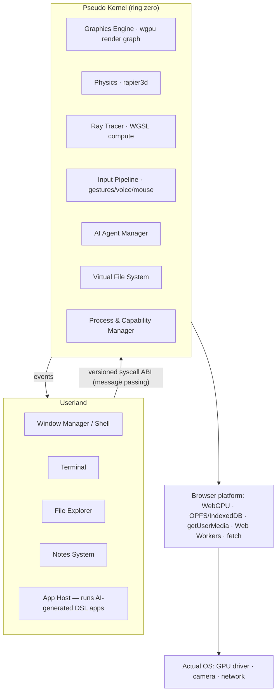

# Pseudo Motion OS
**Introduction — Specification v0.3** *(2026-07-29)*

> This is the entry point of the specification. Details live in the linked documents:
> [[Architecture]] · [[UI]] · [[Hand Gestures]] · [[Computer Sign Language]] · [[Voice Kit]] · [[Notes System]] · [[AI System]] · [[App DSL]] · [[Changelog]]

---

## 1. What is Pseudo Motion OS?

**Pseudo Motion OS (PMOS)** is a browser-native, WebAssembly-powered *pseudo-operating system*: a complete desktop environment — windows, files, terminal, apps — that runs inside a single web page (or as a lightweight Tauri desktop app), rendered with WebGPU inside a persistent 3D world.

It is not an operating system in the hardware sense. It is an **interaction system**: an answer to the question *"what would a computer feel like if graphics, physics, AI, and your hands were the primitives — instead of files, processes, and a mouse?"*

Three ideas define it:

1. **You speak or gesture, and things exist.** An integrated LLM can conjure working applications on demand ("make me a countdown timer with a big red button") as declarative app definitions that run instantly and safely — see [[App DSL]] and [[AI System]].
2. **The desktop is a place, not a plane.** Windows float in a physically simulated 3D space. Objects can be grabbed, thrown, and stacked with your hands, tracked through an ordinary webcam — see [[Hand Gestures]].
3. **Everything is local and portable.** One Rust→WASM binary, your files in your browser's private storage, no mandatory cloud. Open a URL and you are home.

---

## 2. Philosophy

- **Graphics as Kernel** — The display server, window manager, physics engine, and ray tracer are the lowest system layer ("ring zero"), sharing the GPU as the primary computational resource.
- **Gesture-Native, Never Gesture-Only** — Hands are a first-class input, designed to be ergonomic and learnable. But every single action is also reachable by mouse, keyboard, or voice (the *one-hand-is-enough policy* extends further: *no-hands-is-enough*). See [[Hand Gestures#Design principles]].
- **AI-Driven, Human-Governed** — The LLM is a system citizen with real capabilities, but every capability it exercises passes through the kernel's permission system. AI proposes; the kernel and the user dispose.
- **Portable & Transparent** — Everything compiles to `wasm32-unknown-unknown`. The same binary runs in any WebGPU-capable browser or inside a Tauri shell. Data is stored locally.
- **Clean Kernel ABI** — Userland talks to the kernel *only* through a versioned message-passing syscall interface. This is the load-bearing constraint that lets a portfolio showcase grow into a real platform. See [[Architecture#Kernel ABI]].
- **Knowledge is part of the OS** — A built-in, Obsidian-style linked note system makes the OS a thinking environment, not just an app launcher. Voice notes flow into it directly. See [[Notes System]].

---

## 3. Use Cases

PMOS is a showcase, but its interaction model has genuinely practical shapes:

### 3.1 Live teaching & real-time presentation *(flagship use case)*
Teachers of any subject can stand in front of a camera and **conjure explanatory material in real time**: "create a quiz with these three questions", "show a bouncing ball and let me change gravity", "make a fraction visualizer". Because apps are generated live from voice, the lesson adapts to the room instead of following pre-made slides. Physics objects can be grabbed and manipulated mid-explanation — a chemistry teacher tosses molecules together; a math teacher drags a slider conjured ten seconds earlier. The gesture layer means the presenter never touches the keyboard and never turns their back to the audience.

### 3.2 3D/2D artists & visual explainers
Artists get a spatial canvas with real physics and a real-time ray tracer for material/lighting studies (reflection, refraction, soft shadows) without opening a heavyweight DCC tool. Reference images, notes, and palettes float as windows *in* the scene, arranged by hand where they are needed. Explaining composition or lighting to a client becomes an act of physically arranging the explanation.

### 3.3 Kiosks, exhibitions, installations
A URL that turns any machine with a webcam into a touchless interactive exhibit — no drivers, no install, no special hardware.

### 3.4 Streamers & content creators
On-camera overlays and tools (timers, polls, soundboards) conjured live and controlled by gesture while both hands stay visible on stream.

### 3.5 Personal knowledge work
The built-in [[Notes System]] plus voice capture ("🤙 hold → speak → transcribed, linked note") makes PMOS a fast thought-capture surface; the AI can summarize, link, and resurface notes.

### 3.6 Research & prototyping
The clean kernel ABI and the declarative app format make PMOS a testbed for HCI experiments: new gestures, new AI-generation strategies, new spatial window management — each is one subsystem behind one interface.

---

## 4. Overall Architecture (summary)

Full detail in [[Architecture]].

PMOS is split into two logical layers inside one WASM binary:

- The **Pseudo Kernel** owns the GPU, the frame loop, physics, input fusion, AI agents, storage, and the process/capability model.
- **Userland** contains the shell and all applications. Built-in apps are compiled-in Rust modules that are nevertheless *forced through the syscall ABI* (keeping the ABI honest). AI-generated apps are declarative documents interpreted by the **App Host** — they cannot express anything outside their sandbox. See [[App DSL]].
- The **browser is the hardware abstraction layer**: WebGPU is "the GPU driver", OPFS is "the disk", getUserMedia is "the camera", Web Workers are "the cores". In Tauri desktop mode the same binary gains native filesystem access and real embedded browsing. See [[Architecture#Platform interfaces]].

---

## 5. Technology Stack & Justification

| Component | Technology | Why this and not something else |
|-----------|------------|--------------------------------|
| Language | **Rust** → `wasm32-unknown-unknown` | Memory safety without GC pauses (critical for a 60 FPS frame loop), first-class WASM toolchain, and the best ecosystem overlap for wgpu/egui/rapier — all three are native Rust. |
| Graphics | **wgpu 29+** (WebGPU only) | The only portable GPU API with *compute shaders* in the browser (required by the ray tracer). WebGPU is default-on in Chrome/Edge, Safari 26+, Firefox 141+ (~85% global support), so the WebGL2 fallback was deliberately dropped — it cannot run compute and would double the rendering code. Unsupported browsers get a capability-check screen. |
| Engine | **Custom thin layer over wgpu** (no Bevy) | We need full control of the render graph to composite three pipelines per frame (3D scene, async ray-trace compute, egui overlay) *and* to render egui windows into textures placed in 3D. A general engine fights this; a custom graph is smaller, faster to load, and is itself part of the showcase. |
| 2D UI | **egui 0.35+** (`egui-wgpu`, `egui-winit`) | Immediate-mode fits per-frame recomposition of AI-generated UIs perfectly; the DSL widget catalog maps 1:1 onto egui widgets. Mature WASM support. |
| Windowing | **winit 0.30+** | Standard Rust event loop; on web it drives the canvas via `requestAnimationFrame`; same code path under Tauri. |
| Physics | **rapier3d** (CPU, SIMD) | The mature Rust physics engine; WASM-compatible. It has **no GPU backend** — GPU physics would mean writing a custom WGSL solver, which is a research project, so CPU physics is a deliberate scope decision (hundreds of bodies at 60 FPS is ample for a desktop scene). |
| Ray tracing | **Custom WGSL compute shaders** | Whitted-style tracing is well-bounded, visually striking, and shows off WebGPU compute — the point of the exercise. Runs async with progressive refinement so it never blocks the UI. |
| Hand tracking | **`@mediapipe/tasks-vision` `HandLandmarker`** (JS worker) | The maintained successor to the deprecated `@mediapipe/hands`; 21 landmarks/hand, WASM+GPU delegate, runs off-main-thread. Writing our own tracker is out of scope; MediaPipe is the industry default. |
| AI | **Remote APIs first** (Anthropic; OpenAI-compatible), **WebLLM** local later — one abstraction | App generation needs frontier-model quality; remote-first ships value immediately. WebLLM (WebGPU, OpenAI-compatible) slots in as an offline/private backend later. `llama.cpp`→WASM rejected: CPU-only, too slow. See [[AI System]]. |
| App format | **Conjure** — declarative JSON + sandboxed expression language | In-browser Rust compilation does not exist; interpreted definitions load instantly, LLMs emit reliable JSON, and the interpreter *is* the sandbox — capability checks are host-enforced, not advisory. See [[App DSL]]. |
| Storage | **OPFS** (primary) + IndexedDB (fallback) | OPFS gives real byte-level file I/O with sync access handles in workers — the closest thing the web has to a disk. |
| Build | **trunk** + `wasm-bindgen`; dev server COOP/COEP-ready | Standard Rust-WASM pipeline. Threads (SharedArrayBuffer) are deferred: cross-origin isolation conflicts with iframe browsing, and workers cover our concurrency needs (tracking, storage I/O, AI fetch). |
| Desktop | **Tauri** | Same WASM binary in the webview; the Rust backend adds native FS, child-webview browsing (bypasses iframe blocking), and future hardware integrations. Far smaller than Electron. |

---

## 6. Document Map

| Document | Contents |
|----------|----------|
| [[Architecture]] | Layered architecture in depth: kernel subsystems, syscall ABI, process & capability model, frame loop, worker topology, browser/OS interfacing, Tauri mode. |
| [[UI]] | The shell: 3D stage, windows, dock, launcher, command palette, notifications; interaction and focus model across mouse/gesture/voice. |
| [[Hand Gestures]] | Static pose vocabulary, ergonomics rules, recognition pipeline, tuning parameters. |
| [[Computer Sign Language]] | Motion signs (ASL-inspired), the sign-FSM engine, two-handed 3D grammar, face-mesh & gaze roadmap. |
| [[Voice Kit]] | Always-on transcription, the top-right widget, voice commands with AI context, /voice persistence. |
| [[Notes System]] | The Obsidian-style linked notes subsystem: markdown, wikilinks, backlinks, voice capture, AI assistance. |
| [[AI System]] | Agent model, multi-provider support (API keys & local LLMs), tool/syscall interface, app-generation workflow, safety. |
| [[App DSL]] | The Conjure format in full: manifest, state, widgets, events, expression language grammar, actions, limits, examples. |
| [[Changelog]] | Running log of every change to specs and code, plus the decisions log. |

---

*Document maintained by the Pseudo Motion OS project. When anything here changes, record it in [[Changelog]].*
